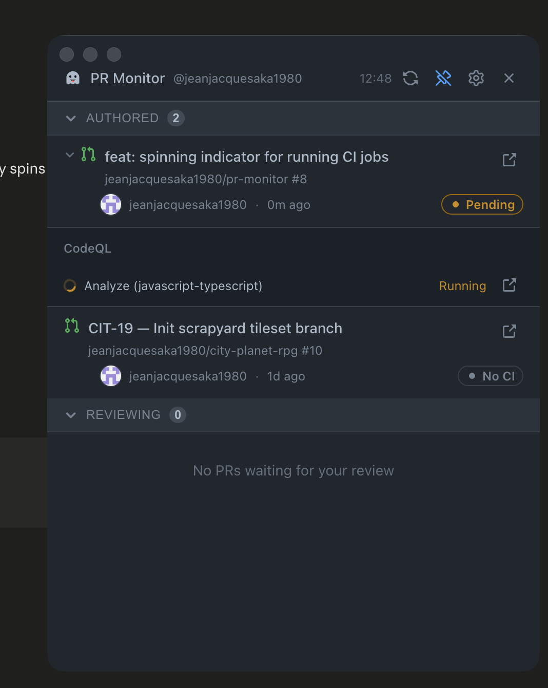

# PR Monitor



A macOS menu bar app that shows all your open GitHub pull requests — authored and under review — with CI status, review decisions, and individual workflow check runs, updated every 60 seconds. Filter by repository or author. Works with both GitHub.com and GitHub Enterprise.

---

## Installation

### Option A — Homebrew (recommended)

No Node.js or cloning required. The app installs as a native macOS `.app`.

**1. Install GitHub CLI and authenticate**

```bash
brew install gh
gh auth login
```

**2. Add the tap and install**

```bash
brew tap jeanjacquesaka1980/homebrew-tap
brew install --cask pr-monitor
```

Launch from Spotlight (`Cmd+Space` → `PR Monitor`) or from Applications. You can also drag it from Applications to your Dock. The ghost icon appears in your menu bar.

> First launch: macOS Gatekeeper will block the app because it is not notarized. Right-click `PR Monitor.app` in Applications → Open → Open to approve it once.

**To upgrade to a new version:**

```bash
brew upgrade --cask pr-monitor
```

---

### Option B — From source

Requires Node.js 20 or 22 and GitHub CLI.

**1. Prerequisites**

```bash
brew install node@22
brew install gh
gh auth login
```

**2. Clone and run**

```bash
git clone https://github.com/jeanjacquesaka1980/pr-monitor.git
cd pr-monitor
npm install
npm run start
```

Builds the app and launches Electron detached from the terminal. You can close the terminal — the app keeps running until you quit it from the menu bar icon or the × button.

**Development mode (attached to terminal):**

```bash
npm run dev
```

**To get the latest version on an existing clone:**

```bash
git pull
npm install  # only if dependencies changed
npm run start
```

---

## Usage

### PR panel

| Element | Description |
|---|---|
| **YOUR PRs** / **OTHERS' PRs** | Click the section header to collapse or expand |
| Chevron `›` on a PR | Expand to see all CI workflow check runs |
| CI badge | `Passing` / `Failing` / `Pending` / `No CI` |
| Review badge | `Approved` / `Changes` / `Review required` |
| `↗` button | Opens the PR in your browser |
| Filter button | Filter by repository — highlighted blue when active; persists across restarts |
| People button | Filter Others' PRs by author — opt-in, nobody selected means the section is empty; persists across restarts |
| Refresh button | Manual refresh (auto-refreshes every 60s) |
| Pin button | Keep the window always on top — clicking elsewhere won't close it |
| Gear button | Open preferences panel |
| `×` button | Fully quit the app |

Warning banners appear at the top of the list when a repo accumulates too many open PRs: yellow at 10+, red at 15+. Both filters are applied before counting.

Click anywhere outside the panel to dismiss it (unless pinned).

### Workflow check runs

Click the chevron next to any PR to expand its CI details. Checks are grouped by workflow:

```
CI
  ✓ build        Passed
  ✗ test         Failed    ↗
──────────────────────────────
Deploy
  ⟳ lint         Running   ↗
```

Running jobs show an animated spinner. Each check run has a direct link to the run page on GitHub.

### Tray icon

- **Left-click** — open / hide the panel
- **Right-click** → **Quit** — fully stop the app

### Preferences

Click the gear icon in the header to open preferences:

| Setting | Description |
|---|---|
| **Launch at login** | Start PR Monitor automatically when you log in to macOS |
| **Start minimised** | Hide the window on launch — access the app via the menu bar icon |

Preferences are saved to `~/Library/Application Support/PR Monitor/preferences.json`.
The login item is managed via a LaunchAgent plist at `~/Library/LaunchAgents/com.pr-monitor.app.plist` — this ensures the correct app path and arguments are passed on login, which macOS's built-in login items API does not support reliably for non-packaged apps.

### Window controls

- **Red button** — hides the window (app keeps running in the tray)
- **Pin button** — window stays on top of all other apps

---

## Troubleshooting

### App shows a stop sign or won't launch

The app binary is damaged or Gatekeeper is blocking it. Quit PR Monitor if it is running, then reinstall cleanly:

```bash
rm -rf "/Applications/PR Monitor.app"
brew reinstall --cask pr-monitor
```

### Upgrading fails with "currently running"

Homebrew detects that PR Monitor is open and refuses to upgrade. Quit the app first (click `×` or right-click the tray icon → Quit), then:

```bash
brew upgrade --cask pr-monitor
```

### Migrating from source install to Homebrew

If you previously ran the app via `npm run start`, the copy in `/Applications` is not owned by Homebrew. Move it to Trash first, then install:

```bash
rm -rf "/Applications/PR Monitor.app"
brew install --cask pr-monitor
```

### Full uninstall

Removes the app and all its data (preferences, launch agent):

```bash
brew uninstall --cask --zap pr-monitor
```

### Force-killing the app

If the app is unresponsive, the tray icon is stuck, or Quit doesn't work, use `-9` (SIGKILL — instant, no chance to ignore):

```bash
pkill -9 -f Electron
```

To confirm nothing is left running:

```bash
pgrep -fl Electron
```

**Tray icon stays after kill** — this is normal macOS behaviour. The OS keeps the last frame visible until you interact with the menu bar. Click the ghost icon once and it disappears.

**Window stays after kill** — same cause. Click anywhere on the desktop or another app window to force macOS to redraw.

### Port 5173 still in use after dev mode crashes

```bash
lsof -ti:5173 | xargs kill -9
```

---

## Project structure

```
src/
├── main/                   ← Electron main process (Node.js)
│   ├── index.ts            ← App lifecycle, window setup
│   ├── tray.ts             ← Menu bar icon, popup positioning, context menu
│   ├── auth.ts             ← gh CLI discovery, GitHub host detection, API execution
│   ├── github.ts           ← GitHub GraphQL query + response normalisation
│   ├── ipc-handlers.ts     ← IPC bridge (main side)
│   ├── prefs.ts            ← Preferences read/write + LaunchAgent login item management
│   └── preload.ts          ← Secure context bridge to renderer
├── renderer/               ← React UI (GitHub Primer design system)
│   ├── components/
│   │   ├── Header.tsx          ← Title bar with filter, author filter, refresh, pin, prefs, quit
│   │   ├── PRSection.tsx       ← Collapsible Your PRs / Others' PRs section
│   │   ├── PRCard.tsx          ← Single PR row with expand toggle
│   │   ├── CheckRunList.tsx    ← Workflow check runs grouped by workflow, spinning indicator for running jobs
│   │   ├── CIBadge.tsx         ← CI status badge
│   │   ├── ReviewBadge.tsx     ← Review decision badge
│   │   ├── RepoFilter.tsx      ← Repository filter dropdown
│   │   ├── UserFilter.tsx      ← Author filter dropdown
│   │   ├── RepoWarningBanner.tsx ← Warning/danger banners for repos with too many open PRs
│   │   ├── AuthGate.tsx        ← Shown when gh is not authenticated
│   │   ├── ErrorBanner.tsx     ← Inline error display
│   │   └── Preferences.tsx     ← Preferences panel (launch at login, start minimised)
│   └── hooks/
│       ├── useAuth.ts      ← Auth state via gh CLI
│       └── usePRs.ts       ← PR polling with 60s interval
└── shared/
    └── types.ts            ← TypeScript types shared between main and renderer
scripts/
└── start.js                ← Detached production launcher (npm run start)
```

---

## Tech stack

| | |
|---|---|
| [Electron 39](https://www.electronjs.org/) | macOS app shell, tray, window management |
| [React 18](https://react.dev/) + [TypeScript 5](https://www.typescriptlang.org/) | UI |
| [GitHub Primer](https://primer.style/react/) | GitHub's own design system |
| [Vite 8](https://vitejs.dev/) | Renderer bundler |
| GitHub GraphQL API | PR list, CI rollup, individual check runs (read-only) |
| `gh` CLI | Auth + API calls — respects corporate proxies automatically |

---

## Changelog

See [CHANGELOG.md](CHANGELOG.md) for the full version history.
